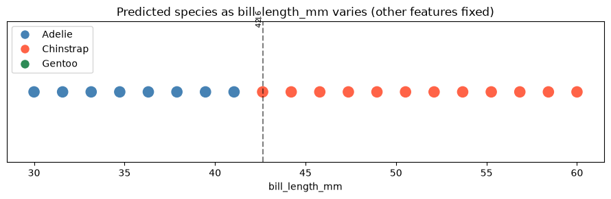

# ml-07-applied

[](https://denisecase.github.io/pro-analytics-02/workflow-b-apply-example-project/)
[](./pyproject.toml)
[](./LICENSE)

> Professional Python project: investigating a deployed machine learning model.

## Project Description

This project focuses on learning to interrogate a deployed ML model
by probing it systematically with different inputs.

We learn to:

- call a live prediction API from a notebook
- vary input features and observe how predictions change
- identify decision boundaries and edge cases
- interpret model behavior from the outside


Links:

- [ml_07_case.ipynb](notebooks/ml_07_case.ipynb)
- [ml_07_jaya.ipynb](notebooks/ml_07_jaya.ipynb)
- [ml_07_jaya_custom.ipynb](notebooks/ml_07_jaya_custom.ipynb)

## Working Files

You'll work with these areas:

- **data/raw** - raw data for exploration (only if you add a dataset)
- **docs/** - project narrative and documentation
- **src/mlstudio/** - the app is an example; run only (no need to modify)
- **notebooks/** - interactive analysis
- **pyproject.toml** - update authorship & links
- **zensical.toml** - update authorship & links

## Additional Packages

This project uses `requests` to make the calls.
Be sure the requests package is listed in `pyproject.toml`.

## Instructions (pro-analytics-02)

Follow the
[step-by-step workflow guide](https://denisecase.github.io/pro-analytics-02/workflow-b-apply-example-project/)
to complete:

1. Phase 1. **Start & Run**
2. Phase 2. **Change Authorship**
3. Phase 3. **Read & Understand**
4. Phase 4. **Modify**
5. Phase 5. **Apply**


## Command Reference

<details>
<summary>Show command reference</summary>

### In a machine terminal (open in your `Repos` folder)

After you get a copy of this repo in your own GitHub account,
open a machine terminal in your `Repos` folder:

```shell
# Replace username with YOUR GitHub username.
git clone https://github.com/jaya-srini/ml-07-applied

cd ml-07-applied
code .
```

### In a VS Code terminal

These are listed for convenience.
For best results, follow the detailed instructions in
[pro-analytics-02 guide](https://denisecase.github.io/pro-analytics-02/).

```shell
uv self update
uv python pin 3.14
uv lock --upgrade
uv sync --extra dev --extra docs --upgrade

uvx pre-commit install
uvx pre-commit autoupdate

git add -A
uvx pre-commit run --all-files
# repeat if changes were made
uvx pre-commit run --all-files

# run the example module to verify the environment (.venv/)
uv run python -m mlstudio.app_case

# run common chores
uv run ruff format .
uv run ruff check . --fix
uv run python -m pyright
uv run python -m pytest
uv run python -m zensical build

# save progress
git add -A
git commit -m "update"
git push -u origin main
```

</details>


## Findings and Visuals

**Commands:** same as the [Command Reference](#command-reference) above -
`uv sync`, then open `notebooks/ml_07_jaya.ipynb` and
`notebooks/ml_07_jaya_custom.ipynb` in VS Code and Run All.

**Process:** `ml_07_jaya.ipynb` reproduces the example investigation
(baseline check, `bill_length_mm` sweep, prediction grid, edge cases) with
one modification - the sweep chart now auto-labels the exact value where the prediction flips species. `ml_07_jaya_custom.ipynb` narrows that down to a single question: does `body_mass_g` alone move the prediction? See [docs/index.md](docs/index.md) for the full write-up.

**Visuals:**




## Project Documentation

Additional project instructions, terms, and notes:

[docs/index.md](docs/index.md)

## Citation

[CITATION.cff](./CITATION.cff)

## License

[MIT](./LICENSE)
