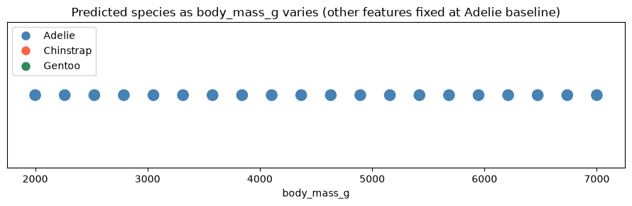

# Project Documentation

This site provides project documentation.
Use the documentation navigation to explore.

## How-To Guide

Many instructions are common to all our projects.

See
[⭐ **Workflow: Apply Example**](https://denisecase.github.io/pro-analytics-02/workflow-b-apply-example-project/)
to get the example projects running on your machine.

## Project Documentation Pages (docs/)

- **Home** - this documentation landing page
- [**Project Instructions**](./project-instructions.md)  - the standard project workflow
- [**Your Files**](./your-files.md) - how to copy the example and create your version
- [**Glossary**](./glossary.md) - project terms and concepts
- [**API**](./api.md) - autogenerated code documentation for the public project interface

## Phase 4. Technical Modification

`ml_07_jaya.ipynb`

Section 3's chart now auto-detects and labels the exact bill_length_mm value(s) where the prediction flips species, using dashed vertical lines instead of requiring a manual read of the color changes or log table. This change would turn "where's the boundary?" from a guess into a one-glance answer, computed directly from the sweep data.Ran the modified cell; confirmed the labeled lines land exactly on the rows in df_sweep where prediction changes from the row before.

Result: The transition is identified and mapped on chart for better understanding. Example shows what the model predicts; this shows where it decides — quantified, not eyeballed.

## Phase 5. Custom Project

`ml_07_jaya_custom.ipynb` narrows the example investigation to one small question instead of covering everything the example does.

### Basis and API

Same model and endpoint as the example: the ML Penguin Predictor
(`https://ml-penguin-predictor.onrender.com/predict`), a supervised classifier that predicts penguin `species` (Adelie, Chinstrap, Gentoo) from
`bill_length_mm`, `bill_depth_mm`, `flipper_length_mm`, and `body_mass_g`.

Kept the same endpoint - the goal was to ask a smaller question of the same model, not to test a different one.

### Investigation Approach

Ran a single-feature sweep of `body_mass_g` (2000g-7000g, 20 steps) while holding the other three features fixed at the Adelie baseline. Reused the
same `predict()` / `sweep_feature()` functions as the example, but skipped the 2D grid and edge-case sections to keep the scope small. Goal: check whether body mass alone, independent of bill/flipper shape, can move the model's decision.

### Findings: Feature Sensitivity

`body_mass_g` predicted Adelie at all 20 points across the full 2000-7000g range - no boundary, no transition. By contrast, the example's `bill_length_mm` sweep flipped Adelie -> Chinstrap at ~42.6mm. So bill length drives this model's decision far more than body mass does; mass alone (with bill/flipper fixed) isn't decisive. Caveat: this only rules out mass in isolation from an Adelie-shaped baseline, not mass interacting with other features.

### Summary

This model leans heavily on bill geometry and barely at all on body mass to separate species - body mass on its own is not a reliable signal. The API is confident (no errors, no boundary) but that confidence may be
misplaced if the input is genuinely mass-driven and bill/flipper values are missing or defaulted. Same kind of check would apply to any classifier
where you want to know whether a feature is "for show" or actually load-bearing before trusting or dropping it.

